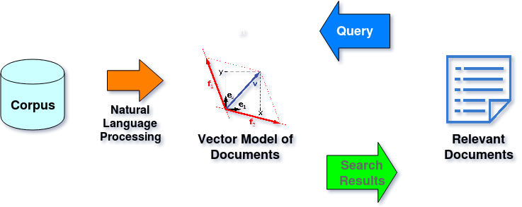

[](https://travis-ci.org/zjohn77/retrieval)



## 1. The Goal of this Project:
Develop an Elasticsearch-comparable, full-text search engine using Node.js and making use of cutting-edge NLP concepts. And make it tunable to different types of texts (e.g. tweets, scientifc journals) via the use of [BM25](https://nlp.stanford.edu/IR-book/html/htmledition/okapi-bm25-a-non-binary-model-1.html)

## 2. Key Features and Benefits:
* Source code is on NPM and can be deployed to a large, growing ecosystem of Node.js apps such as Express, Meteor, etc.
* Tune it to specific types of documents (e.g. tweets, scientific journals, legal writing) for improved accuracy.
* By default, it uses the BM25 similarity, just like [Elasticsearch](https://www.elastic.co/guide/en/elasticsearch/reference/current/index-modules-similarity.html)
* Separates offline indexing from the time-sensitive online search.
* Each individual NLP component, like the stemmer or the stopword list, is pluggable and carefully researched to keep at the bleeding edge. (For example, the stopword list is a confluence of the best words from three authoritative stopword lists: the Stanford CoreNLP, Journal of Machine Learning Research, and NLTK.)
* Reasonable unit test coverage, continuous integration, and separation of concerns for each functionality.
* Dockerfile and Docker images available to facilitate quickly trying out the demos.

## 3. The Design:
This function indexes an input array of texts using the Okapi BM25 similarity, and stores the resulting document-term matrix as an array of arrays. Function's main argument is a text document collection in the form of an array of strings, with each text document being a string.

## 4. Install:
```bash
npm install retrieval
```

## 5. Usage:
The following example is from "scenarios.js" found in the "demo/demo1" directory.
```js
/*
 * Demonstrates how to use the Retrieval module via 4 quick examples.
 * Namely, 
 * (1) search for 'theme and variations'; note that docs where both terms 
 * appear are ranked higher
 * (2) in 'opera browser', the word 'browser' doesn't belong to any document,
 * so the search engine only returns documents with the word 'opera'
 * (3) none of the words in 'does not exist' belong to any document, so
 * the result looks empty
 * (4) search for 'blues'; note that both singular and plural forms were found;
 * also note that duplicate documents were found, which is fine because they
 * exist in the document collection.
 */
const Retrieval = require("../../../retrieval"); // Import the search engine.
const docs = require("./data/music-collection"); // Load the texts to search.

// 1st step: construct an object, feeding two parameters for bm25.
let rt = new Retrieval(K=2, B=0.75);

// 2nd step: index the texts loaded above.
rt.index(docs);

// 3rd step: search.
console.log("------------------------------------------------------------");
console.log("Top 5 search results for the query 'theme and variations':\n");
let results = rt.search("theme and variations", 5);
results.map(result => console.log(result));
// 04 - Theme & Variations In G Minor.flac
// 17 - Rhapsody On A Theme of Paganini - Variation 18.flac
// 01 - Diabelli Variations - Theme Vivace & Variation 1 Alla Marcia Maestoso.flac
// 07 - Rhapsody On A Theme of Paganini (Introduction and 24 Variations).flac
// 10 - Diabelli Variations - Variation 10 Presto.flac

console.log("\n\n----------------------------------------------------------");
console.log("Top 5 search results for the query 'opera browser':\n")
results = rt.search('opera browser', 5);
results.map(result => console.log(result));
// 01 - Così Fan Tutte, Opera, K. 588- Overture.flac
// 09 - Il Trovatore, Opera- Act 4. Scene 1. Miserere.flac
// 04 - Der Rosenkavalier, Opera, Op. 59 (TrV 227)- Unidentified Excerpt.flac
// 07 - Così Fan Tutte, Opera, K. 588- Act 1. Scene 3. In Uomini, In Soldati.flac
// 11 - Così Fan Tutte, Opera, K. 588- Act 1. Scene 3. E Voi Ridete.flac

console.log("\n\n----------------------------------------------------------");
console.log("Top 5 search results for the query 'does not exist':\n")
results = rt.search('does not exist', 5);
results.map(result => console.log(result));

console.log("\n\n----------------------------------------------------------");
console.log("Top 5 search results for the query 'blues':\n")
results = rt.search('blues', 5);
results.map(result => console.log(result));
// 09 - Weary Blues.flac
// 09 - Weary Blues.flac
// 11 - The Blue Danube Op. 314.flac
// 06 - Wild Man Blues.flac
// 08 - Potato Head Blues.flac
```

## 6. Integrate into your project:
Here's a web app with full-text search capability added:


Try it. Enter: 
```bash
npm run demo2
```
Then, point browser to localhost:8080 . Source code is "demo/demo2/scenarios.js".

## 7. Build upon it:
Clone it to your computer:
```bash
git clone https://github.com/zjohn77/retrieval.git
cd retrieval
npm install
```
Run unit tests:
```bash
npm test
```

## 8. Issues & Potential Enhancements:
While BM25 is a sparse vector model, recent advances in NLP have made available dense vector models that are better equipped to take advantage of synonyms, polysemy, word order, and other intricate language features. (It would be nice to extend this project to incorporate word2vec, GloVe, FastText.)